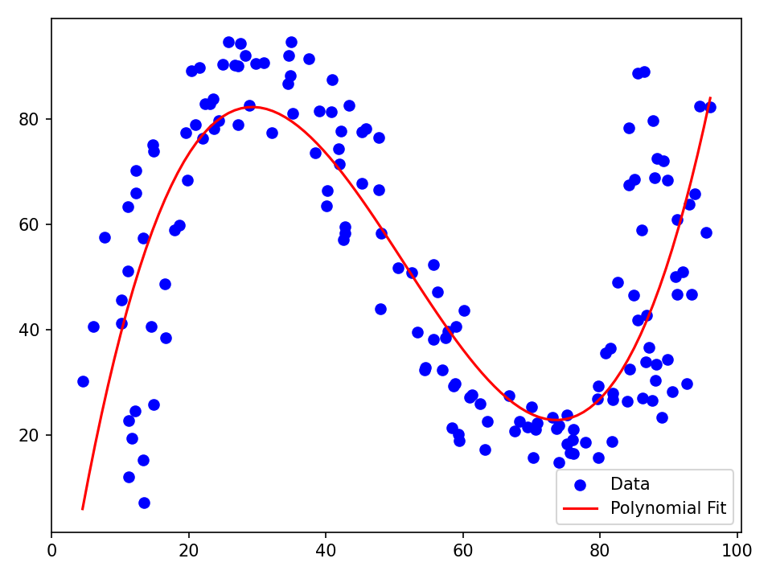
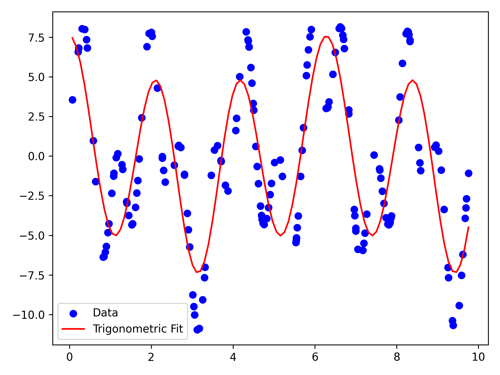
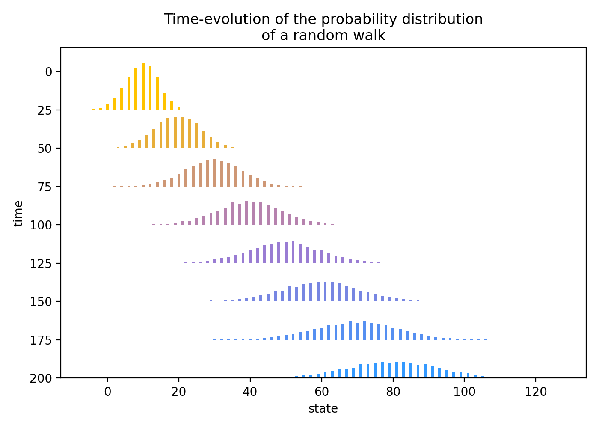
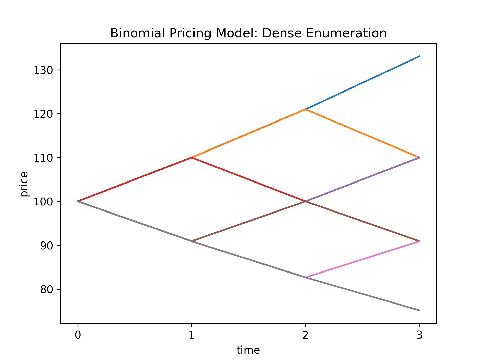
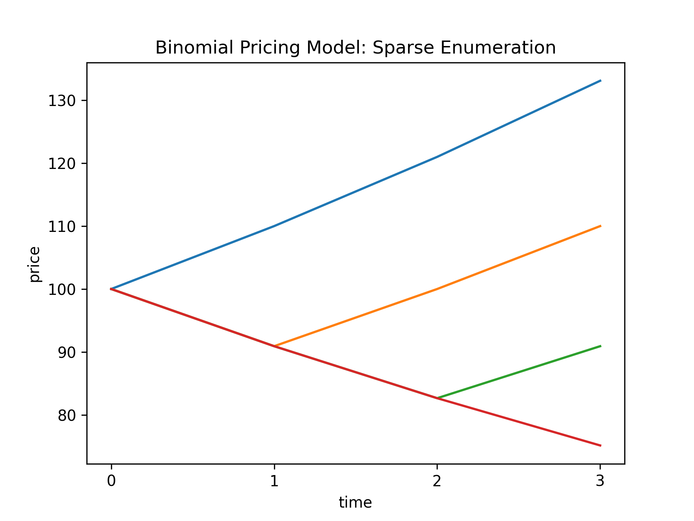

# Code Snippets

The following code snippets demonstrate how to use the basic objects and methods of SigAlg. This page is not yet comprehensive, so the user will need to inspect the [API reference](../api/index.md) for additional code examples. More code snippets will be added to this page as they are written.

It is also worth checking out the [extended introduction to SigAlg](https://johnmyers-phd.com/writings.html#category=SigAlg){target="_blank"}.

## Sample spaces

### Creating sample spaces

API References: [`SampleSpace`](../api/core.md#sigalg.core.SampleSpace){target="_blank"}

=== "create_sample_space.py"
    ```python
    --8<-- "create_sample_space.py"
    ```

    1. Create a sample space $\Omega = \{H, T\}$ from a Python list.
    2. Create a sample space $\Omega = \{1, 2, 3, 4, 5, 6\}$ using the `from_sequence` method.
    3. Create a sample space $\Omega = \{\omega_0, \omega_1, \omega_2, \omega_3\}$ using the `from_sequence` method with a prefix.
    4. Create a sample space $\Omega = \{\text{red}, \text{green}, \text{blue}\}$ from a `pd.Index` with the `from_pandas` method.

=== "Output"
    ```
    --8<-- "create_sample_space_output.txt"
    ```

### Extracting events

API References: [`SampleSpace`](../api/core.md#sigalg.core.SampleSpace){target="_blank"}

=== "extract_event.py"
    ```python
    --8<-- "extract_event.py"
    ```
    
    1. Create a sample space $\Omega = \{\omega_1, \omega_2, \omega_3, \omega_4, \omega_5\}$.
    2. Extract the event $A=\{\omega_1, \omega_2, \omega_3\}$ using the `get_event` method.
    3. Extract the event $B=\{\omega_3, \omega_4, \omega_5\}$ by (positional-based) slicing.
    4. Extract the event $C=\{\omega_1, \omega_4\}$ by (positional-based) indexing.

=== "Output"
    ```
    --8<-- "extract_event_output.txt"
    ```

### Creating probability spaces

API References: [`ProbabilityMeasure`](../api/core.md#sigalg.core.ProbabilityMeasure){target="_blank"}, [`SampleSpace`](../api/core.md#sigalg.core.SampleSpace){target="_blank"}, [`SigmaAlgebra`](../api/core.md#sigalg.core.SigmaAlgebra){target="_blank"}

=== "create_prob_space.py"
    ```python
    --8<-- "create_prob_space.py"
    ```

    1. Create a sample space $\Omega = \{0,1,2,3\}$.
    2. Create a $\sigma$-algebra $\mathcal{F}$ on $\Omega$ with atoms $A_0 = \{0,2\}$ and $A_1 = \{1,3\}$.
    3. Create a probability measure $P$ on $\Omega$ with $P(\{\omega\}) = \begin{cases} 0.1 & \text{if } \omega = 0 \\ 0.2 & \text{if } \omega = 1 \\ 0.4 & \text{if } \omega = 2 \\ 0.3 & \text{if } \omega = 3 \end{cases}$
    4. Create a probability space $(\Omega, \mathcal{F}, P)$.

=== "Output"
    ```
    --8<-- "create_prob_space_output.txt"
    ```

### Accessing underlying data

API References: [`SampleSpace`](../api/core.md#sigalg.core.SampleSpace){target="_blank"}

=== "sample_space_data.py"
    ```python
    --8<-- "sample_space_data.py"
    ```

    1. Create a sample space $\Omega = \{s_0,s_1,s_2,s_3,s_4\}$.
    2. Access the underlying data of the sample space as a `pd.Index` using the `data` attribute.

=== "Output"
    ```
    --8<-- "sample_space_data_output.txt"
    ```

## Events

### Set operations

API References: [`Event`](../api/core.md#sigalg.core.Event){target="_blank"}, [`SampleSpace`](../api/core.md#sigalg.core.SampleSpace){target="_blank"}

=== "set_operations.py"
    ```python
    --8<-- "set_operations.py"
    ```

    1. Create a sample space $\Omega = \{0,1,2,3,4\}$.

=== "Output"
    ```
    --8<-- "set_operations_output.txt"
    ```

### Order operations

API References: [`Event`](../api/core.md#sigalg.core.Event){target="_blank"}, [`SampleSpace`](../api/core.md#sigalg.core.SampleSpace){target="_blank"}

=== "order_operations.py"
    ```python
    --8<-- "order_operations.py"
    ```

    1. Create a sample space $\Omega = \{0,1,2,3,4\}$.

=== "Output"
    ```
    --8<-- "order_operations_output.txt"
    ```


## Event spaces

### Creating event spaces

API References: [`EventSpace`](../api/core.md#sigalg.core.EventSpace){target="_blank"}, [`SampleSpace`](../api/core.md#sigalg.core.SampleSpace){target="_blank"}, [`SigmaAlgebra`](../api/core.md#sigalg.core.SigmaAlgebra){target="_blank"}

=== "create_event_space.py"
    ```python
    --8<-- "create_event_space.py"
    ```

    1. Create a sample space $\Omega = \{0,1,2,3\}$.
    2. Create a $\sigma$-algebra $\mathcal{F}$ on $\Omega$ with atoms $A_0 = \{0,1\}$, $A_1 = \{2\}, A_2 = \{3\}$.
    3. Create an event space $(\Omega, \mathcal{F})$.
    4. The sample space $\Omega$ and $\sigma$-algebra $\mathcal{F}$ are accessible as attributes of the event space.
    5. Define a new $\sigma$-algebra $\mathcal{G}$.
    6. The `sigma_algebra` attribute of the event space is settable, so we can replace $\mathcal{F}$ with $\mathcal{G}$.

=== "Output"
    ```
    --8<-- "create_event_space_output.txt"
    ```


### Event space inherited methods

API References: [`EventSpace`](../api/core.md#sigalg.core.EventSpace){target="_blank"}, [`SampleSpace`](../api/core.md#sigalg.core.SampleSpace){target="_blank"}, [`SigmaAlgebra`](../api/core.md#sigalg.core.SigmaAlgebra){target="_blank"}

=== "event_space_methods.py"
    ```python
    --8<-- "event_space_methods.py"
    ```

    1. Create a sample space $\Omega = \{0,1,2,3\}$.
    2. Create a $\sigma$-algebra $\mathcal{F}$ on $\Omega$ with atoms $A_0 = \{0,1\}$, $A_1 = \{2\}, A_2 = \{3\}$.
    3. Create an event space $(\Omega, \mathcal{F})$
    4. The `EventSpace` inherits the method `get_event` from `SampleSpace`.
    5. The `EventSpace` inherits the method `is_measurable` from `SigmaAlgebra`. The event $A$ is *not* measurable, since it is not a union of atoms, but the event $B$ is measurable, since it is a union of atoms.


=== "Output"
    ```
    --8<-- "event_space_methods_output.txt"
    ```

## $\sigma$-algebras

### Creating $\sigma$-algebras

API References: [`SampleSpace`](../api/core.md#sigalg.core.SampleSpace){target="_blank"}, [`SigmaAlgebra`](../api/core.md#sigalg.core.SigmaAlgebra){target="_blank"}

=== "create_sigma_algebra.py"
    ```python
    --8<-- "create_sigma_algebra.py"
    ```

    1. Create a sample space $\Omega = \{0,1,2,3,4\}$.
    2. A $\sigma$-algebra $\mathcal{F}$ on $\Omega = \{0,1,2,3,4\}$ is determined by its minimal (with respect to subset inclusion) non-empty sets, called *atoms*. We will define $\mathcal{F}$ by declaring its atoms to be $A_0 = \{0,2\}$, $A_1 = \{1,3\}$ and $A_2 = \{4\}$. The dictionary on this line maps each sample point in $\Omega$ to the the index of its atom.
    3. Instantiate the $\sigma$-algebra $\mathcal{F}$ with the dictionary.
    4. Print the $\sigma$-algebra.

=== "Output"
    ```
    --8<-- "create_sigma_algebra_output.txt"
    ```

## Probability spaces

### Creating probability spaces

API References: [`ProbabilityMeasure`](../api/core.md#sigalg.core.ProbabilityMeasure){target="_blank"}, [`ProbabilitySpace`](../api/core.md#sigalg.core.ProbabilitySpace){target="_blank"}, [`SampleSpace`](../api/core.md#sigalg.core.SampleSpace){target="_blank"}, [`SigmaAlgebra`](../api/core.md#sigalg.core.SigmaAlgebra){target="_blank"}

=== "create_probability_space.py"
    ```python
    --8<-- "create_probability_space.py"
    ```

    1. Create a sample space $\Omega = \{0,1,2,3\}$.
    2. Create a $\sigma$-algebra $\mathcal{F}$ on $\Omega$ with atoms $A_0 = \{0,1\}$, $A_1 = \{2\}, A_2 = \{3\}$.
    3. Create a probability measure $P$ on $\Omega$ with $P(\{\omega\}) = \begin{cases} 0.1 & \text{if } \omega = 0 \\ 0.2 & \text{if } \omega = 1 \\ 0.4 & \text{if } \omega = 2 \\ 0.3 & \text{if } \omega = 3 \end{cases}$
    4. Create a probability space $(\Omega, \mathcal{F}, P)$.
    5. The sample space $\Omega$, $\sigma$-algebra $\mathcal{F}$, and probability measure $P$ are accessible as attributes of the probability space.
    6. Define a new $\sigma$-algebra $\mathcal{G}$.
    7. Define a new probability measure $Q$ on $\Omega$.
    8. The `sigma_algebra` and `probability_measure` attributes of the probability space are settable, so we can replace $\mathcal{F}$ with $\mathcal{G}$ and $P$ with $Q$.
    

=== "Output"
    ```
    --8<-- "create_probability_space_output.txt"
    ```

### Probability space inherited methods

API References: [`ProbabilitySpace`](../api/core.md#sigalg.core.ProbabilitySpace){target="_blank"}, [`SampleSpace`](../api/core.md#sigalg.core.SampleSpace){target="_blank"}, [`SigmaAlgebra`](../api/core.md#sigalg.core.SigmaAlgebra){target="_blank"}, [`ProbabilityMeasure`](../api/core.md#sigalg.core.ProbabilityMeasure){target="_blank"}

=== "probability_space_methods.py"
    ```python
    --8<-- "probability_space_methods.py"
    ```

    1. Create a sample space $\Omega = \{0,1,2,3\}$.
    2. Create a probability space $(\Omega, \mathcal{F}, P)$, with default $\sigma$-algebra $\mathcal{F}$, the power set of $\Omega$, and default probability measure $P$, the uniform distribution on $\Omega$.
    3. The `ProbabilitySpace` inherits the method `get_event` from `SampleSpace`.
    4. The `ProbabilitySpace` inherits the method `is_measurable` from `SigmaAlgebra`.
    5. The `ProbabilitySpace` inherits the method `P` from `ProbabilityMeasure`, which computes the probability of an event.

=== "Output"
    ```
    --8<-- "probability_space_methods_output.txt"
    ```

<!-- ## Time

### Creating time

API References: [`Time`](../api/core.md#sigalg.core.Time){target="_blank"}

=== "create_time.py"
    ```python
    --8<-- "create_time.py"
    ```

    1. Create a discrete time index $T = \{1, 2, 3, 4\}$ using the `discrete` class method, along with the `start` and `stop` parameters.
    2. Create a discrete time index $T = \{1, 2, 3, 4, 5, 6\}$ using the `discrete` class method, along with the `start` and `length` parameters. Bear in mind that the latter parameter is the duration of time spanned by the index, **not** the number of time points in the index.

=== "Output"
    ```
    --8<-- "create_time_output.txt"
    ``` -->

## $L^2$-spaces

### Creating $L^2$-spaces

API References: [`L2`](../api/l2.md#sigalg.l2.L2){target="_blank"}, [`SampleSpace`](../api/core.md#sigalg.core.SampleSpace){target="_blank"}, [`SigmaAlgebra`](../api/core.md#sigalg.core.SigmaAlgebra){target="_blank"}, [`ProbabilityMeasure`](../api/core.md#sigalg.core.ProbabilityMeasure){target="_blank"}

=== "create_l2_space.py"
    ```python
    --8<-- "create_l2_space.py"
    ```

    1. Create a sample space $\Omega = \{0,1,2,3\}$.
    2. Create a $\sigma$-algebra $\mathcal{F}$ on $\Omega$.
    3. Create a probability measure $P$ on $\Omega$.
    4. Create the space $H = L^2(\Omega, \mathcal{F}, P)$.
    5. Define two random variables $X,Y: \Omega \to \mathbb{R}$.
    6. The random variable $X$ is constant on the atoms of $\mathcal{F}$, therefore it is $\mathcal{F}$-measurable, so it is in $H$.
    7. The random variable $Y$ is not constant on the atoms of $\mathcal{F}$, therefore it is not $\mathcal{F}$-measurable, so it is not in $H$.

=== "Output"
    ```
    --8<-- "create_l2_space_output.txt"
    ```

### Bases of $L^2$-spaces

API References: [`L2`](../api/l2.md#sigalg.l2.L2){target="_blank"}, [`SampleSpace`](../api/core.md#sigalg.core.SampleSpace){target="_blank"}, [`SigmaAlgebra`](../api/core.md#sigalg.core.SigmaAlgebra){target="_blank"}, [`ProbabilityMeasure`](../api/core.md#sigalg.core.ProbabilityMeasure){target="_blank"}

=== "l2_basis.py"
    ```python
    --8<-- "l2_basis.py"
    ```

    1. Create a sample space $\Omega = \{0,1,2\}$.
    2. Create a $\sigma$-algebra $\mathcal{F}$ on $\Omega$.
    3. Create a probability measure $P$ on $\Omega$.
    4. Create the space $H = L^2(\Omega, \mathcal{F}, P)$.
    5. The basis consists of normalized indicator functions of the atoms of $\mathcal{F}$. This is an orthonormal basis of $H$.
    6. Define a new probability measure $Q$ on $\Omega$ that assigns zero probability to one of the atoms of $\mathcal{F}$.
    7. Change the probability measure of the $L^2$-space to $Q$, so that now $H = L^2(\Omega, \mathcal{F}, Q)$.
    8. The basis is updated to reflect the change in the probability measure, so the indicator function of the atom with zero probability is removed from the basis. The $L^2$-space is only $1$-dimensional under $Q$.

=== "Output"
    ```
    --8<-- "l2_basis_output.txt"
    ```

### Polynomial regression with $L^2$-spaces

API References: [`L2`](../api/l2.md#sigalg.l2.L2){target="_blank"}, [`SampleSpace`](../api/core.md#sigalg.core.SampleSpace){target="_blank"}, [`ProbabilityMeasure`](../api/core.md#sigalg.core.ProbabilityMeasure){target="_blank"}

=== "polynomial_regression.py"
    ```python
    --8<-- "polynomial_regression.py"
    ```

    1. The data consists of $159$ pairs $(x,y)$ of real numbers. We want to find a cubic polynomial that fits the data well.
    2. Load the data into a `RandomVector` object using the `from_numpy` method.
    3. The sample space $\Omega$ and probability meausure $P$ are automatically created; $\Omega$ consists of the numbers $0,1,\ldots,158$, and $P$ is the uniform distribution on $\Omega$.
    4. Extract the component random variables $X$ and $Y$ from the random vector $Z=(X,Y)$.
    5. Create the $L^2$-space $H = L^2(\Omega, \mathcal{F}, P)$, where $\mathcal{F}$ is the default $\sigma$-algebra on $\Omega$, the power set.
    6. Perform an orthogonal projection of $Y$ onto the subspace of cubic polynomials in $X$. The coefficients of the best-fit polynomial are stored in a `np.ndarray` object `u`.
    7. Extract the coefficients from `u` and create the best-fit polynomial.
    8. Plot the data and the fitted polynomial.

=== "Output"
    {width=50%}

### Trigonometric polynomials in $L^2$-spaces

API References: [`L2`](../api/l2.md#sigalg.l2.L2){target="_blank"}, [`SampleSpace`](../api/core.md#sigalg.core.SampleSpace){target="_blank"}, [`ProbabilityMeasure`](../api/core.md#sigalg.core.ProbabilityMeasure){target="_blank"}

=== "fourier_polynomials.py"
    ```python
    --8<-- "fourier_polynomials.py"
    ```

    1. The data consists of $175$ pairs $(x,y)$ of real numbers. We want to find a trigonometric polynomial that fits the data well.
    2. Load the data into a `RandomVector` object using the `from_numpy` method.
    3. The sample space $\Omega$ and probability meausure $P$ are automatically created; $\Omega$ consists of the numbers $0,1,\ldots,174$, and $P$ is the uniform distribution on $\Omega$.
    4. Extract the component random variables $X$ and $Y$ from the random vector $Z=(X,Y)$.
    5. Create the $L^2$-space $H = L^2(\Omega, \mathcal{F}, P)$, where $\mathcal{F}$ is the default $\sigma$-algebra on $\Omega$, the power set.
    6. Perform an orthogonal projection of $Y$ onto a subspace of trigonometric polynomials in $X$. The coefficients of the best-fit polynomial are stored in a `np.ndarray` object `u`.
    7. Extract the coefficients from `u` and create the best-fit polynomial.
    8. Plot the data and the fitted polynomial.


=== "Output"
    {width=50%}

## Stochastic processes

### Diffusion of random walk transition probabilities

API References: [`Time`](../api/core.md#sigalg.core.Time){target="_blank"}, [`RandomWalk`](../api/processes.md#sigalg.processes.RandomWalk){target="_blank"}

=== "random_walk_diffusion.py"
    ```python
    --8<-- "random_walk_diffusion.py"
    ```

    1. Simulate $10{,}000$ trajectories of length $200$ of a random walk $X$ with initial state $X_0=0$ and probability of an up-move $p=0.7$.
    2. Generate a list of times $t=25, 50, \ldots, 200$ at which to plot the empirical probability distribution of $X_t$.
    3. Define custom colors.
    4. The random variable $X_t$ is simulated with draws $\{x_1,x_2,\ldots,x_{10{,}000}\}$, where $x_i$ is the value of the $i$-th trajectory at time $t$. The probability distribution is uniform over these draws, $P(\{x_i\}) = 1/10{,}000$ for $i=1,2,\ldots,10{,}000$. The empirical probability distribution of $X_t$ is computed by grouping the draws together and adding their uniform probabilities. So, if $x$ is a value in the range of $X_t$ and $n_x$ is the number of draws equal to $x$, then the empirical probability of $X_t=x$ is $P(X_t=x) = n_x/10{,}000$. This empirical probability distribution is first computed by accessing the `range` attribute, which groups the draws together, then accessing the `data` attribute of the `probability_measure`, which returns a `pd.Series` object containing the empirical probabilities of the unique values in the range of $X_t$.
    5. The `data` attribute of the `range` returns a `pd.Series` containing the unique values in the range of $X_t$.
    6. Plot an empirical probability distribution on a line of the ridgeline plot.
    7. Scale the empirical probabilities by a factor of $175$ to make the ridgeline plot easier to read.

=== "Output"
    {width=50%}

### Gambling strategy as an adapted process with winnings as an Itô integral

API References: [`RandomVariable`](../api/core.md#sigalg.core.RandomVariable){target="_blank"}, [`Time`](../api/core.md#sigalg.core.Time){target="_blank"}, [`ProcessTransforms`](../api/processes.md#sigalg.processes.ProcessTransforms){target="_blank"}, [`RandomWalk`](../api/processes.md#sigalg.processes.RandomWalk){target="_blank"}, [`StochasticProcess`](../api/processes.md#sigalg.processes.StochasticProcess){target="_blank"}

=== "gambling_strategy.py"
    ```python
    --8<-- "gambling_strategy.py"
    ```

    1. Gameplay is indexed by the discrete time index $T = \{0,1,2,3\}$, corresponding to three games played after the initial time $0$.
    2. The process $Y$ is the *price process* of the game, which tracks the cumulative winnings of the bettor if they were to wager $1$ unit on each game beginning from $Y_0=0$. The (forward) increment $\Delta Y_t = Y_{t+1} - Y_t$ represents the outcome of the $(t+1)$-th game. An increment of $+1$ represents a win for the bettor, and an increment of $-1$ represents a loss. The probability of winning is $p=0.4$, so the house has an edge.
    3. A *betting strategy* is, by definition, a process $X$ adapted to the natural filtration of $Y$. The value $X_t$ is the bettor's wager on the $(t+1)$-th game. We construct such a process through three transformations $X_0 = f_0(Y_0)$, $X_1 = f_1(Y_0, Y_1)$, and $X_2 = f_2(Y_0, Y_1, Y_2)$. We set $f_0(Y_0)=1$, so the bettor wagers $1$ unit on the first game, no matter what.
    4. On the second game, the bettor wagers $2$ units if the first game is a winner, and wagers nothing if the first game is a loser.
    5. On the third game, the bettor wagers $3$ units if the first two games are winners; wagers $2$ units if the second game is a winner but the first game is a loser; wagers $1$ unit if the first game is a winner but the second game is a loser; and wagers nothing if the first two games are losers.
    6. Apply the transformations to the process $Y$ to obtain $X$.
    7. The bettor's winnings are the Itô integral of $X$ with respect to $Y$.
    8. Compute the expected winnings of the bettor after the three games.
    9. Check that $Y$ really is unfair to the bettor by verifying that $Y$ is a supermartingale.
    10. Print the increments of $Y$ to see which games are winners and which are losers.
    11. Print the betting strategy $X$.
    12. Check that $X$ is adapted to the natural filtration of $Y$.
    13. Print the bettor's winnings.
    14. Check if the bettor's strategy is a losing strategy by verifying if the winnings process is a supermartingale.
    15. Print the expected winnings of the bettor after the three games.

=== "Output"
    ```
    --8<-- "gambling_strategy_output.txt"
    ```

## Finance

### Binomial asset pricing model

API References: [`BinomialPricingModel`](../api/finance.md#sigalg.finance.BinomialPricingModel)

=== "binomial_pricing_model.py"
    ```python
    --8<-- "binomial_pricing_model.py"
    ```

    1. The asset has an initial price of $S_0=100$ USD.
    2. For each time step in the model, the price of the asset can either increase by a factor of $u=1.1$, or it can fall by a factor of $d = 1/u \approx 0.91$.
    3. The probability of an up-move is $p=0.7$, and the probability of a down-move is $1-p=0.3$.
    4. The asset is traded in a market that includes a bank account with a *risk-free* per-period rate of interest $r = 0.01$.
    5. The length of the model is $3$ time steps.
    6. Set up the binomial pricing model with the parameters defined above.
    7. The `from_enumeration` method in `dense` mode computes all $8=2^3$ possible price trajectories of the asset.
    8. Plot all the price trajectories of the asset in the dense enumeration.
    9. The real-world probability measure is computed from the up-move probability $p$ and down-move probability $1-p$.
    10. The risk-neutral measure is computed from the risk-free rate $r$ and the up and down factors $u$ and $d$.
    11. Check that the discounted price process is a martingale under the risk-neutral measure.
    12. The `from_enumeration` method in `sparse` mode computes four canonical price trajectories of the asset.
    13. Plot the four canonical price trajectories of the asset in the sparse enumeration.
    14. The real-world probability measure is computed from the up-move probability $p$ and down-move probability $1-p$.
    15. The risk-neutral measure is computed from the risk-free rate $r$ and the up and down factors $u$ and $d$.
    
=== "Text Output"
    ```
    --8<-- "binomial_pricing_model_output.txt"
    ```

=== "Figures"
    {width=50%}
    {width=50%}